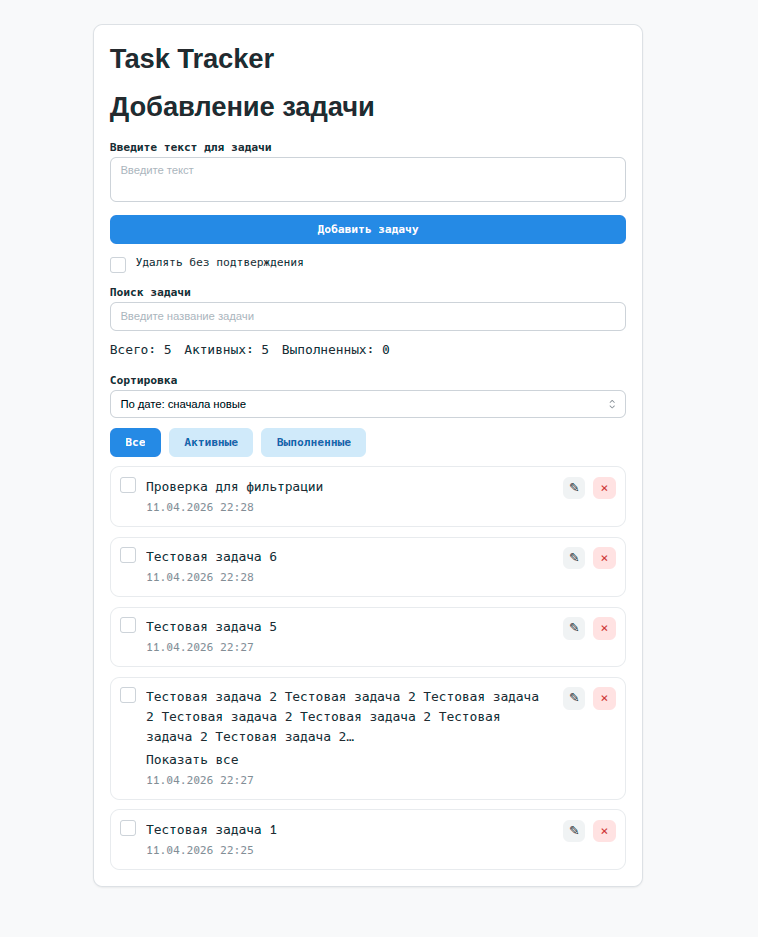
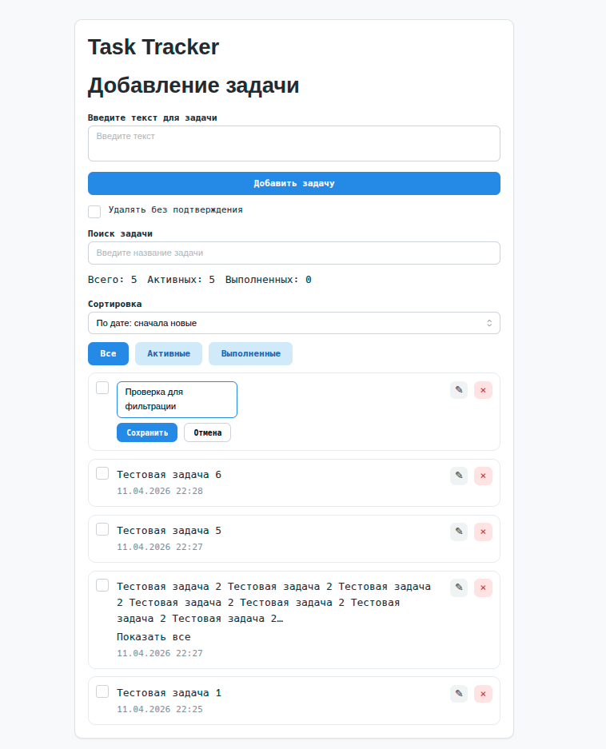
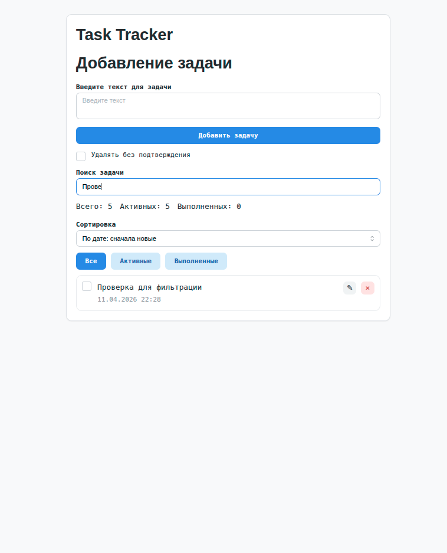

# Task Tracker

Простое приложение для управления задачами на `React + TypeScript + Redux Toolkit`.

В проекте реализованы:

- создание задачи
- сохранение задач в `localStorage`
- загрузка задач из `localStorage`
- переключение статуса задачи
- удаление задачи с подтверждением
- редактирование задачи
- поиск задач
- фильтрация задач
- сортировка задач
- статистика по задачам

## Стек

- React
- TypeScript
- Redux Toolkit
- Mantine
- Zod
- dayjs
- SCSS
- Vite

## Запуск проекта

### Docker Compose

```bash
docker compose up --build
```

Проект будет доступен по адресу:

```bash
http://localhost:4287
```

### Для разработки

```bash
npm install
npm run dev
```

Проект будет доступен по адресу:

```bash
http://localhost:5173
```

### Сборка

```bash
npm run build
```

### Preview

```bash
npm run preview
```

### Lint

```bash
npm run lint
```

## Что реализовано

### Работа с задачами

- добавление новой задачи
- редактирование названия задачи
- удаление задачи
- переключение статуса выполнения

### Работа со списком

- поиск по названию задачи
- фильтр: все / активные / выполненные
- сортировка:
  - по дате создания по возрастанию
  - по дате создания по убыванию
  - по названию от А до Я
  - по названию от Я до А

### Хранение данных

- хранение списка задач в `localStorage`
- восстановление списка после перезагрузки страницы

### Дополнительно

- статистика по задачам

## Скриншоты

### Главный экран



### Редактирование задачи



### Фильтрация и поиск



## Видео

### Демонстрация проекта

[demo.webm](https://github.com/user-attachments/assets/8c7aafac-29e2-49a5-a211-02ada76df7cc)

## TODO

- внедрить API вместо `localStorage`
- перенести логику работы с задачами на backend
- добавить авторизацию
- добавить режим `Kanban` с переключением вида
- добавить пагинацию для большого списка задач
- добавить дедлайны и приоритеты задач
- добавить теги и категории
- добавить тесты
